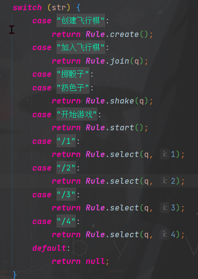

## 一个群内飞行棋的插件

玩法:
- 普通飞行棋玩法 2,4,6点 起飞 起飞后才可进行移动
- 不同颜色棋子落在同一个地方会前者会被击回
- 投掷到6可在掷一次 但是连续掷到3个6所有棋子全部返回
- 踩到与自身颜色相同的棋子跳跃到下个相同颜色
- 飞机站直接起飞
- 终点必须掷到剩余路的点数才可到终点,否则后退多余的点数
- 

其命令:

    创建飞行棋
    加入飞行棋        #最大四个玩家,最小2个 
    掷骰子/扔色子     
    开始游戏         #人数2,3人时使用即可开始游戏
    /1             #选择要操作的棋子 下同
    /2
    /3
    /4

配合 [chat-command](https://github.com/project-mirai/chat-command)

    /flyChess clearTemp    # 清除缓存图片
    /flyChess overGame    # 结束游戏

存在bug请及时开 反馈/issue 

感谢您的使用/游玩
